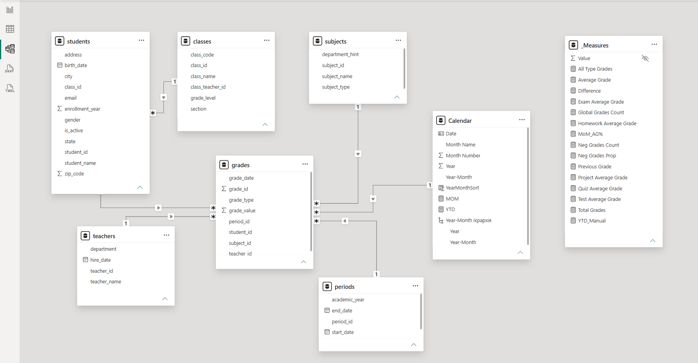
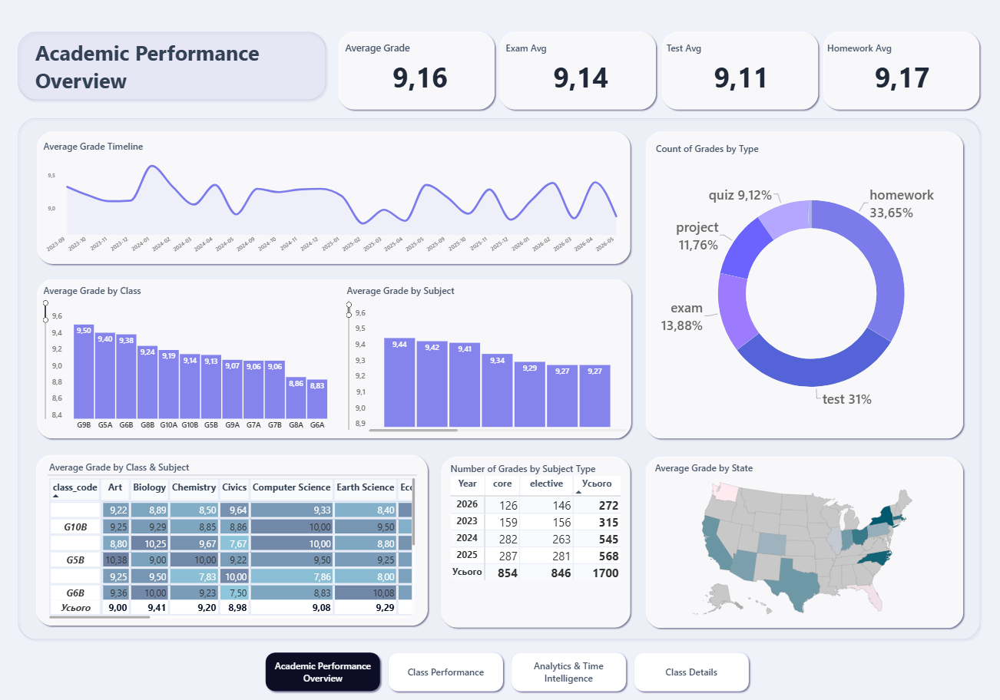
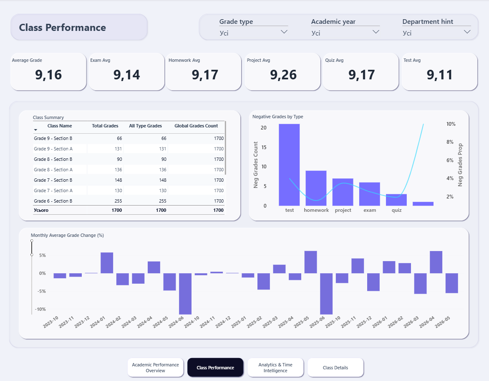
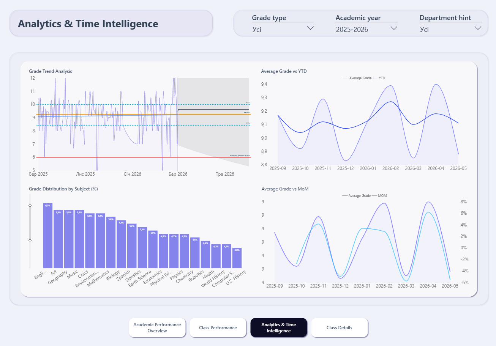
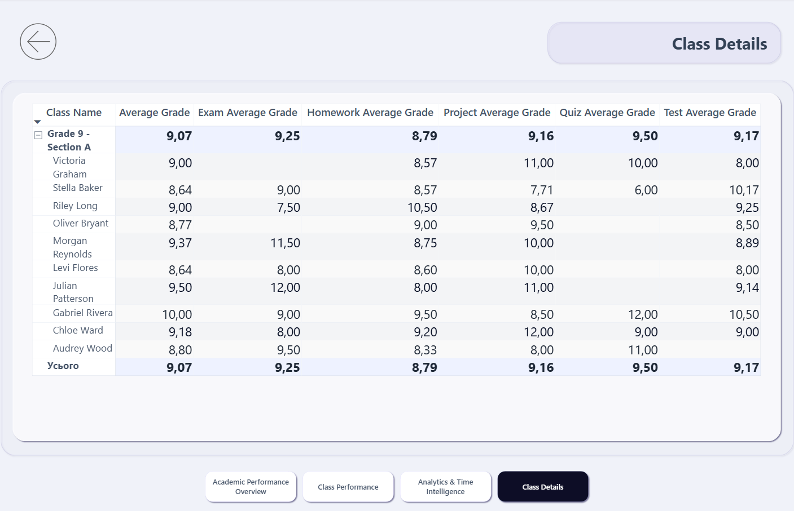
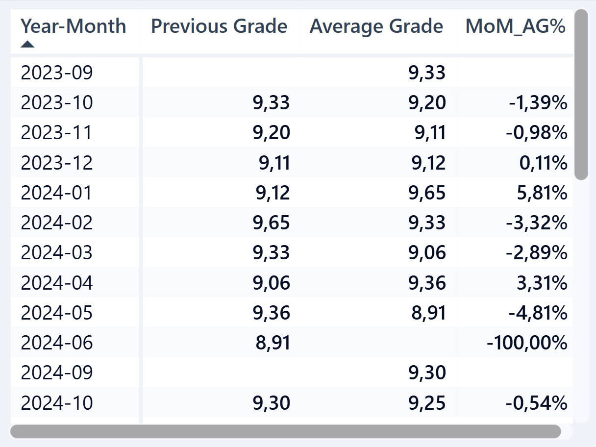

# Academic Performance Overview

### End-to-End Data Analytics Project | Power BI

An interactive Power BI dashboard designed to analyze academic performance across students, classes, subjects, assessment types, academic periods, and regions.

The project demonstrates an end-to-end data analytics workflow — from data preparation and modeling to DAX calculations, interactive reporting, and analytical insights.

---

## 📌 Project Overview

The objective of this project was to build an analytical solution for exploring academic performance and identifying patterns across different dimensions of the educational dataset.

The dashboard allows users to:

- monitor overall academic performance;
- compare results across classes and subjects;
- analyze performance by assessment type;
- identify patterns in negative grades;
- track academic performance over time;
- compare current results with previous periods;
- analyze performance by academic year;
- drill through from class-level results to individual student details;
- explore geographical differences in academic performance.

---

## 🔄 End-to-End Analytics Workflow

The project covers the complete data analytics lifecycle:

**Data Preparation → Data Modeling → DAX & Analysis → Visualization → Insights**

### 1. Data Preparation

The data was prepared and transformed for further analytical use.

Key activities included:

- data cleaning and validation;
- data transformation;
- preparation of fields for analysis;
- organizing data from multiple related entities;
- preparing date fields for time-based analysis.

### 2. Data Modeling

A dimensional analytical model was created with `grades` as the central fact table.

The model includes related entities such as:

- `students`
- `classes`
- `subjects`
- `teachers`
- `periods`
- `Calendar`

A dedicated Calendar table was created to support time-based analysis and time-intelligence calculations.

### 3. DAX & Analytical Calculations

DAX measures were created to calculate and analyze key academic metrics, including:

- Average Grade
- Exam Average Grade
- Homework Average Grade
- Project Average Grade
- Quiz Average Grade
- Test Average Grade
- Total Grades
- Negative Grades Count
- Negative Grades Proportion
- Previous Grade
- Month-over-Month change
- Year-to-Date performance

Measures were organized separately in a dedicated `_Measures` table to keep the analytical model structured and easier to maintain.

### 4. Data Visualization & Interactivity

The final report combines multiple interactive visualization and navigation techniques:

- KPI cards;
- column charts;
- line charts;
- donut charts;
- matrix tables;
- conditional formatting;
- geographic maps;
- interactive dropdown filters;
- cross-filtering;
- drill-through navigation;
- custom tooltip pages;
- detailed student-level views.

### 5. Analytical Insights

The dashboard was used to identify:

- differences in performance between classes;
- subject-level performance patterns;
- differences between assessment types;
- patterns in negative grades;
- monthly fluctuations in academic performance;
- changes compared with previous periods;
- differences in performance across geographic regions.

---

## 🧩 Data Model

The data model follows a star-schema approach, with `grades` serving as the central fact table and surrounding tables providing contextual information for analysis.

The model connects academic results with student, class, subject, teacher, period, and calendar information.

### Model Structure

- **Fact table:** `grades`
- **Dimension tables:** `students`, `classes`, `subjects`, `teachers`, `periods`, `Calendar`
- **Measures:** `_Measures`

The Calendar dimension contains fields for:

- Date
- Year
- Month Name
- Month Number
- Year-Month
- YearMonthSort

It also supports time-intelligence calculations such as YTD and MoM analysis.

---

## 📊 Dashboard

The report consists of four main analytical pages.

### 1. Academic Performance Overview

The overview page provides a high-level summary of academic performance.

Key elements include:

- Overall Average Grade;
- Average Grade by Assessment Type;
- Average Grade by Class;
- Average Grade by Subject;
- Grade Type Distribution;
- Class × Subject Performance Matrix;
- Number of Grades by Academic Year;
- Average Grade by State.

---

### 2. Class Performance

The Class Performance page focuses on comparing academic results across classes.

Interactive dropdown filters allow users to analyze results by:

- Grade Type;
- Academic Year;
- Department.

The page includes:

- class-level performance comparison;
- assessment-type KPIs;
- negative grades analysis;
- monthly average grade changes;
- interactive filtering;
- drill-through navigation from class-level performance to detailed student-level analysis.

The drill-through functionality allows users to select a class and move from aggregated class performance to a detailed view of individual students and their assessment results.

---

### 3. Analytics & Time Intelligence

This page focuses on trend analysis and time-based calculations.

The analysis includes:

- Grade Trend Analysis;
- Average Grade vs YTD;
- Average Grade vs MoM;
- Grade Distribution by Subject.

The page helps identify changes in academic performance over time and compare current results with previous periods.

---

### 4. Class Details

The Class Details page provides a more granular view of academic performance.

The page is accessible through drill-through navigation from class-level analysis, allowing users to move from aggregated class performance to individual student results.

For each student, the dashboard provides:

- Average Grade;
- Exam Average Grade;
- Homework Average Grade;
- Project Average Grade;
- Quiz Average Grade;
- Test Average Grade.

This detailed view makes it possible to investigate individual performance within the selected class.

---

## 💬 Interactive Tooltips

Custom tooltip pages were used to provide additional analytical context without overcrowding the main dashboard.

For the **Monthly Average Grade Change (%)** visualization, hovering over a month displays additional details, including:

- Year-Month;
- Previous Grade;
- Average Grade;
- MoM change.

This approach allows users to explore additional analytical details while keeping the main dashboard visually clean.

---

## 📈 Time Intelligence

Time-based analysis was implemented using a dedicated Calendar table and DAX measures.

The project includes calculations for:

- Previous Grade;
- Month-over-Month change;
- Year-to-Date performance.

These calculations allow the analysis to compare current academic performance with previous periods and identify positive or negative changes over time.

---

## 🔎 Key Insights

The dashboard provides several analytical findings from the available dataset.

### Overall Performance

The overall average grade is **9.16**.

Among the assessment types shown on the dashboard:

- Project Average: **9.26**
- Homework Average: **9.17**
- Quiz Average: **9.17**
- Exam Average: **9.14**
- Test Average: **9.11**

Project assessments have the highest average grade, while tests have the lowest average among the displayed assessment types.

### Assessment Distribution

Homework represents the largest share of recorded grades at **33.65%**, followed by:

- Test — **31.00%**
- Exam — **13.88%**
- Project — **11.76%**
- Quiz — **9.12%**

Homework and Test assessments therefore account for the majority of recorded grades in the dataset.

### Class Performance

The dashboard shows noticeable differences in average performance between classes.

For example:

- **G9B — 9.50**
- **G5A — 9.40**
- **G6B — 9.38**

while lower-performing classes in the displayed overview include:

- **G8A — 8.86**
- **G6A — 8.83**

These differences can be used as a starting point for further analysis of factors associated with variations in class performance.

### Negative Grades

The dashboard also compares negative grades across assessment types, allowing potential performance risks to be identified and investigated at a more granular level.

---

## 🛠️ Tools & Technologies

### Power BI

- Power Query
- Data Modeling
- DAX
- Time Intelligence
- Interactive Visualization
- Drill-through
- Custom Tooltips

### Analytical Techniques

- Data Cleaning & Validation
- KPI Analysis
- Comparative Analysis
- Trend Analysis
- Performance Analysis
- Time-Series Analysis
- Drill-through Analysis
- Student-Level Analysis

---

## 💡 Technical Highlights

This project demonstrates practical experience with the following areas:

### Data Preparation

- Cleaning and transforming analytical data;
- preparing multiple related datasets for analysis;
- validating and organizing data for reporting.

### Data Modeling

- Building a dimensional analytical model;
- working with fact and dimension tables;
- creating a dedicated Calendar dimension;
- managing relationships between tables;
- organizing DAX measures in a dedicated measures table.

### DAX & Time Intelligence

- Creating analytical measures;
- working with filter context;
- calculating previous-period values;
- implementing MoM analysis;
- implementing YTD calculations;
- creating KPI measures.

### Interactive Reporting

- Designing multi-page interactive dashboards;
- using dropdown filters and slicers;
- applying cross-filtering;
- implementing drill-through navigation;
- creating custom tooltip pages;
- using conditional formatting;
- providing detailed student-level analysis.

### Data Analysis

- Comparing academic performance;
- identifying trends and fluctuations;
- analyzing assessment patterns;
- comparing classes and subjects;
- investigating negative-grade patterns;
- exploring geographical differences in performance.

---

## 📁 Project Files

The repository contains:

- [Academic Performance Overview.pbix](Academic%20Performance%20Overview.pbix) — downloadable Power BI Desktop project file;
- dashboard screenshots;
- data model visualization;
- project documentation.

---

## 🎯 Project Outcome

The final dashboard provides an interactive analytical environment for exploring academic performance from a high-level overview to detailed student-level results.

The project demonstrates the ability to work through the **full data analytics workflow**:

> **Data → Preparation → Modeling → Analysis → Visualization → Insights**

Rather than focusing only on dashboard design, the project combines data preparation, data modeling, DAX calculations, time intelligence, interactive reporting, drill-through navigation, custom tooltips, and interpretation of analytical results.
